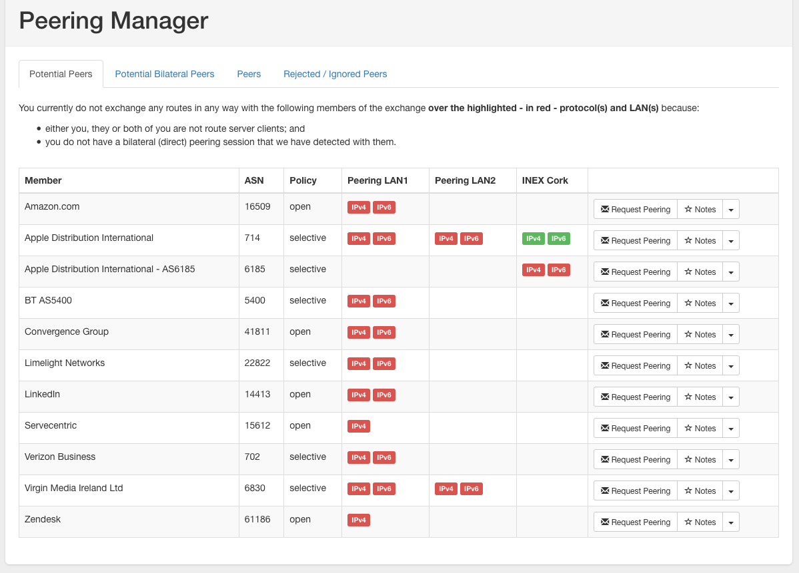

# Peering Manager

The Peering Manager is a fantastic tool that allows your members to view and track their peerings with other IXP members. The display is broken into four tabs for each member:



* **Potential Peers:** Fellow IXP members where you neither peer them via the route servers or bilaterally;
* **Potential Bilateral Peers:** Fellow route server members that could also be picked up for a direct bilateral peering should you so desire;
* **Peers:** Fellow IXP members that you peer with via the route servers, bilaterally or both;
* **Rejected / Ignored:** You can move members from any of the other tabs to this tab if you wish to ignore them, or if they have refused peering. This allows you to keep the other lists clean.

The mechanism for detecting bilateral peers is by by observing established TCP sessions between member peering IP addresses on port 179 using [sflow](../grapher/sflow.md]). See the [peering matrix documentation](peering-matrix.md) as setting up the peering matrix will provide all the data needed for the peering manager.

**NB: You must check the *Peering Manager* option when editing VLANs for that VLAN to be included in the peering manager.**

The features of the peering manager include:

* the ability to request peerings with an auto-generated peering request which is built up of all your own details as well as the other member's details (ASN, IP address, NOC details, etc);
* logging of peering requests sent (and which user sent them) in the peers notes file;
* logging of when the last peering request was sent and a warning if you try to send another too quickly;
* the ability to add custom notes against each peer with a clear indicator that those notes exist;
* the ability to manually move a peer to the *Peers* or *Rejected / Ignored* tabs.

## Required Configuration Settings

This feature requires some settings in your `.env` which you may have already set:

```ini
;; the various identity settings
IDENTITY_...

;; the default VLAN's database ID (get this from the DB ID column in VLANs)
IDENTITY_DEFAULT_VLAN=1
```

The default peering request email template can be found at `resources/views/peering-manager/peering-message.foil.php`. You can [skin](skinning.md) this if you wish but it is generic enough to use as is.

## Disabling the Peering Manager

You can disable the peering manager by setting the following in `.env`:

```
IXP_FE_FRONTEND_DISABLED_PEERING_MANAGER=true
```


## Peering Manager Test Mode

For testing / experimentation purposes, you can enable a test mode which, when enabled, will send all peering requests to the defined test email.

To enable test mode, just set the following in `.env`:

```
PEERING_MANAGER_TESTMODE=true
PEERING_MANAGER_TESTEMAIL=user@example.com
```

When test mode is enabled, there will be a clear alert displayed at the top of the peering manager page.

Normally, the peering manager adds a note to the peer's notes and sets a request last sent date when a peering request is sent. In test mode, this will not happen. If you want this to happen in test mode, set these to true:

```
PEERING_MANAGER_TESTNOTE=true
PEERING_MANAGER_TESTDATE=true
```
