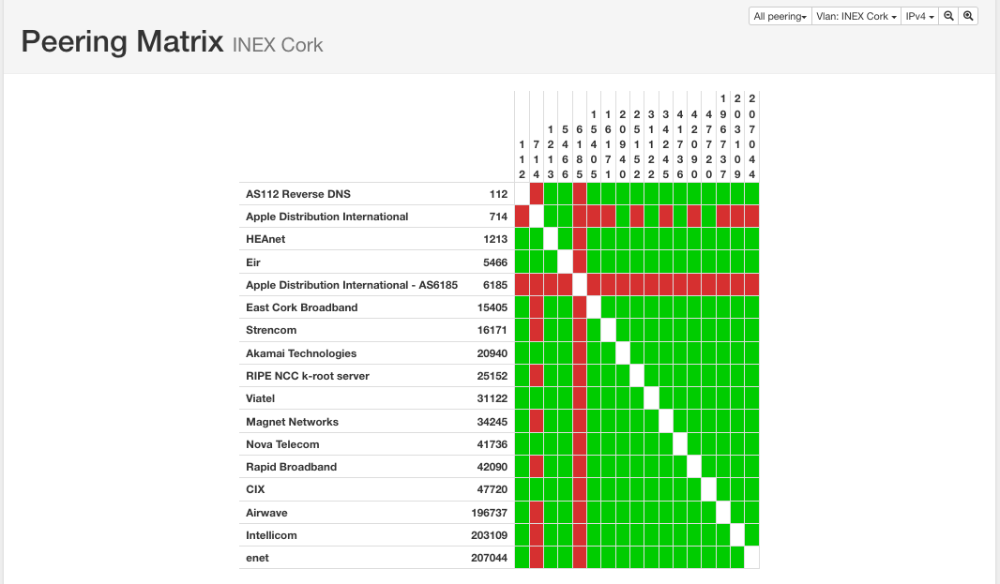

# Peering Matrix

## Overview

The peering matrix system builds up a list of who is peering with whom over your IXP.




There are two primary data sources: route server clients and sflow.  Currently, it is assumed that all IXP participants who connect to the route server have an open peering policy and do not filter prefixes.

**NB:** You must check the *Peering Matrix* option when editing VLANs for that VLAN to be included in the peering matrix on the frontend.

### Data Source: Route Server Clients

Route server clients are automatically shown as peering with each other onm the peering matrix. No operator input is required for this.

### Data Source: sflow BGP session detection

IXP Manager can pick out active BGP sessions from an sflow data feed.  This is handled using the `sflow-detect-ixp-bgp-sessions` script.  As this is a perl script, it is necessary to install all the perl modules listed in the `check-perl-dependencies.pl` script.

Sflow is a packet sampling mechanism, which means that it will take some while before the peering database is populated. After 24 hours of operation, the peering database should be relatively complete.

`sflow-detect-ixp-bgp-sessions` needs its own dedicated sflow data feed, so it is necessary to set up sflow data fan-out using the `sflowtool` as described in the [sflow fan-out section here](sflow.md#fanout).  INEX normally uses udp port 5501 for its bgp detection sflow feed.

For more information, see the [sflow documentation](../grapher/sflow.md).


### Configuring ixpmanager.conf

In addition to the correct SQL configuration for the `<sql>` section, `sflow-detect-ixp-bgp-sessions` needs the following options set in the `<ixp>` section of [`ixpmanager.conf`](https://github.com/inex/IXP-Manager/blob/32d6388cab1d7299f1917655b78edebf3e71181a/tools/perl-lib/IXPManager/ixpmanager.conf.dist):

* `sflowtool`: the location of the `sflowtool` binary.
* `sflowtool_bgp_opts`: command line arguments for `sflowtool`.

### Sample ixpmanager.conf
```
<ixp>
  # location of sflow executable
  sflowtool = /usr/local/bin/sflowtool

  # sflow listener to p2p rrd exporter, listening on udp port 5500
  sflowtool_opts = -4 -p 5500 -l

  # sflow listener for BGP peering matrix, listening on udp port 5501
  sflowtool_bgp_opts = -4 -p 5501 -l
</ixp>
```

### Testing the daemon

The system can be tested using `sflow-detect-ixp-bgp-sessions --debug`.  If it starts up correctly, the script should occasionally print out peering sessions like this:

```
DEBUG: [2001:db8::ff]:64979 - [2001:db8::7]:179 tcpflags 000010000: ack. database updated.
DEBUG: [192.0.2.126]:30502 - [192.0.2.44]:179 tcpflags 000010000: ack. database updated.
DEBUG: [2001:db8::5:0:1]:179 - [2001:db8::4:0:2]:32952 tcpflags 000011000: ack psh. database updated.
```

### Running the daemon in production

The script `control-sflow-detect-ixp-bgp-sessions` should be copied (and edited if necessary) to the operating system startup directory so that `sflow-detect-ixp-bgp-sessions` is started as a normal daemon.

## Controlling Access to the Peering Matrix

The peering matrix is publically available by default. However you can limit access to a minimum user privilege by setting `PEERING_MATRIX_MIN_AUTH` to an integer from 0 to 3 in your `.env`. See [here for what these integers mean](../usage/users.md#types-of-users). For example, to limit access to any logged in user, set the following:

```
PEERING_MATRIX_MIN_AUTH=1
```

You can disable the peering matrix by setting the following in `.env`:

```
IXP_FE_FRONTEND_DISABLED_PEERING_MATRIX=true
```


## Troubleshooting

* The script doesn't print anything when in debug mode

This probably means that it's not getting an sflow feed.  Check to ensure that sflowtool is feeding the script correctly by using the `sflow-detect-ixp-bgp-sessions --insanedebug`.  This should print out what the script is reading from sflowtool.  Under normal circumstances, this will be very noisy.

* The script prints `ignored - no address match in database` when in debug mode

If the IP addresses match those on the IXP's peering LAN, then the IP address database is not populated correctly.  This can be fixed by entering the IXP's addresses in the `IP Addressing` menu of the web UI.
