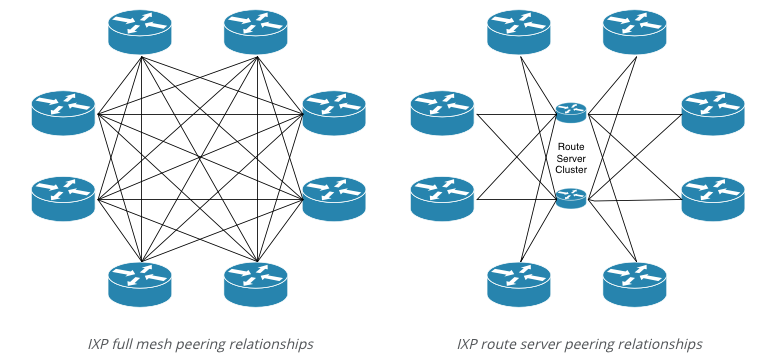
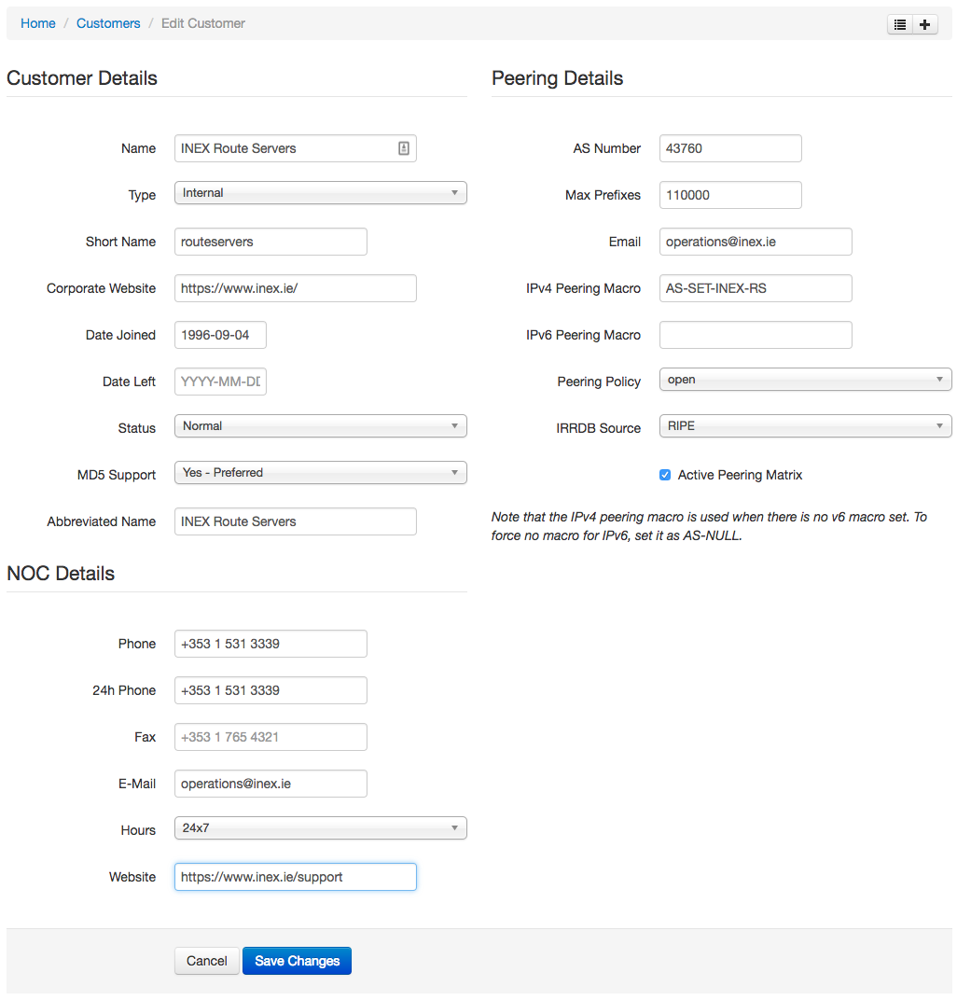

# Route Servers

> **Prerequisite Reading:** Ensure you first familiarize yourself with [the generic documentation on managing and generating router configurations here](routers.md).

Normally on a peering exchange, all connected parties will establish bilateral peering relationships with each other customer connected to the exchange. As the number of connected parties increases, it becomes increasingly more difficult to manage peering relationships with customers of the exchange. A typical peering exchange full-mesh eBGP configuration might look something similar to the diagram on the left hand side.

The full-mesh BGP session relationship scenario requires that each BGP speaker configure and manage BGP sessions to every other BGP speaker on the exchange. In this example, a full-mesh setup requires 7 BGP sessions per member router, and this increases every time a new member connects to the exchange.

However, by using a route servers for peering relationships, the number of BGP sessions per router stays at two: one for each route server (assuming a resilient set up). Clearly this is a more sustainable way of maintaining IXP peering relationships with a large number of participants.

## Configuration Generation Features

Please [review the generic router documentation](routers.md) to learn how to automatically generate route server configurations. This section goes into a bit more specific detail on INEX's route server configuration (as shipped with IXP Manager) and why it's safe to use.

You should also look at the following resources:

*  watch the *IXP Manager Update & Route Server Configuration* presentation from the 32nd Euro-IX Forum held in Galway, Ireland, April 2018: [[pdf](https://www.ixpmanager.org/media/2018/20180417-euroix-ixpmanager.pdf)] [[video](https://www.ixpmanager.org/videos/201804-euroix.mp4)].
* to fully understand RPKI with IXP Manager, [watch our presentation](https://www.inex.ie/inex-news/shiny-new-route-servers/) from APRICOT 2019.
*  [read this article]( https://youtu.be/cqhJwuBaxxQ?t=1549) on INEX's website.

The features of the route server configurations that IXP Manager generates include:

* [RPKI support](rpki.md) when using the Bird v2 templates;
* full prefix filtering based on IRRDB entries (can be disabled on a per member basis if required) - see [the IRRDB documentation here](irrdb.md);
* full origin ASN filtering based on IRRDB entries (can be disabled on a per member basis if required);
* in all cases, prefix filtering for IPv4 and v6 based on the IANA special purpose registries (also known as bogon lists);
* ensuring next hop is the neighbor address to ensure no next hop hijacking;
* max prefix limits;
* multiple VLAN interfaces for a single member supported;
* large BGP communities supported;
* over a decade of production use and experience.

With Bird v2 support in IXP Manager v5, we provide better looking glass integration and other tooling to show members which prefixes are filtered and why. The Bird v2 filtering mechanism is as follows:

1. Filter small prefixes (default is > /24 / /48 for ipv4 / ipv6).
2. Filter martians / bogons prefixes ([see this template](https://github.com/inex/IXP-Manager/blob/master/resources/views/api/v4/router/server/bird2/header.foil.php)).
3. Sanity check - filter prefixes with no AS path or > 64 ASNs in AS path.
4. Sanity check to ensure peer AS is the same as first AS in the prefix’s AS path.
5. Prevent next-hop hijacking. This occurs when a participant advertises a prefix with a next hop IP other than their own. An exception exists to allow participants with multiple connections advertise their other router (next-hop within the same AS).
6. Filter known transit networks - see FIXME
7. IRRDB filtering: ensure origin AS is in set of ASNs from member AS-SET.
8. RPKI:
    * Valid -> accept
    * Invalid -> drop
9. RPKI Unknown -> revert to standard IRRDB prefix filtering.

## Setting Up

You first need to add your route servers to the **IXP Manager** routers database. See [this page on how to do that](routers.md).

Typically an IXP's route server service will have a dedicated ASN that is different to the IXP's own management / route collector ASN. As such, you need to add a new *internal* customer to IXP Manager.

**You are strongly advised to use / request a 16-bit ASN from your RIR for route server use. If you do not, you will be unable to offer your members standard community based filtering.**

Here's an example from INEX for our *route server #1*:

You then need to create an interface for this route server on each peering LAN where the service will be offered. Here again is INEX's example from our peering LAN1 in Dublin:

There's a couple things to note in the above:

1. *AS112 Client* is checked which means (so long as *Route Server Client* is checked on the [AS112 service](as112.md)) the AS112 service will peer with the route servers.
2. *Apply IRRDB Filtering* has no meaning here as this is the route server rather than the route server client.
