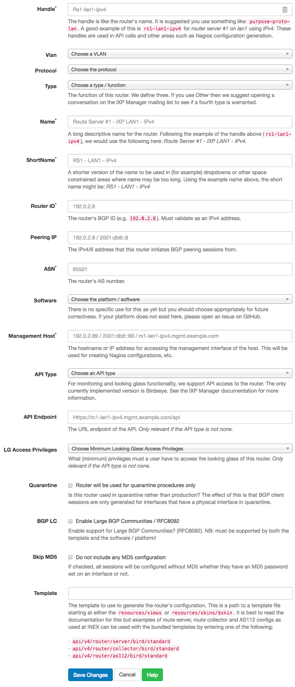

# Routers

IXP Manager can generate router configuration for typical IXP services such as:

* [route collectors](route-collectors.md);
* [route servers](route-servers.md) (with [IRRDB filtering](irrdb.md)); and
* [AS112 services](as112.md).

See the above pages for specific information on each of those use cases and below for instructions on how to generate configuration.

## Managing Routers

The basic elements of *a router* are configured in **IXP Manager** under the *IXP Admin Actions - Routers* option on the left hand menu.

When you goto add / edit a router, the green help button willl provide explanatory details on each field of information required:



From the router management page, you can:

* add / edit / delete a router;
* view all the details of a router;
* generate and view a router's configuration.

## Configuration Generation Overview

The simplest configuration to generate is the route collector configuration. A route collector is an IXP router which serves only to *accept all routes and export no routes*. It is used for problem diagnosis, to aid customer monitoring and for looking glasses (see [INEX's here](https://www.inex.ie/ixp/lg/rc1-lan1-ipv4)).

The [standard configuration](https://github.com/inex/IXP-Manager/blob/master/resources/views/api/v4/router/collector/bird/standard.foil.php) simply pulls in a fairly standard header (sets up router ID, listening address and - for the collector at least - some unused filters) and creates a session for all customer routers on the given VLAN.

When adding a router, you give it a *handle*. For example: `rc1-lan1-ipv4` which, for INEX, would mean a route collector on peering LAN1 using IPv4. Then - for the given router handle - the configuration can be generated and pulled using the API as follows:

```sh
#! /bin/sh

# The API Key.
# This is generated in IXP Manager via the top right menu: *My Account -> API Keys*
KEY="your-admin-ixp-manager-api-key"

# The base URL of your IXP Manager install plus: 'api/v4/router/gen-config'
URL="https://ixp.example.com/api/v4/router/gen-config"

# The handle is as described above:
HANDLE="rc1-lan1-ipv4"

# Then the configuration can be pulled as follows:
curl --fail -s -H "X-IXP-Manager-API-Key: ${KEY}" ${URL}/${HANDLE} >${HANDLE}.conf
```

Configurations for the route server and AS112 templates can be configured just as easily.

 The stock templates for both are secure and well tested and can be used by setting the `template` element of the router to one of the following:

* AS112: `'api/v4/router/as112/bird/standard'`
* Route Server: `'api/v4/router/server/bird/standard'`

We also provide sample scripts for automating the re-configuration of these services by cron. See the `-v4` scripts [in this directory](https://github.com/inex/IXP-Manager/tree/master/tools/runtime/route-servers). These are quite robust and have been in production for ~3 years at INEX (as of Jan 2017).


## Examples

We use [Travis CI](../dev/ci.md) to test IXP Manager before pushing new releases. The primary purpose of this is to ensure that the configuration for routers generated matches known good configurations from the same sample database.

These known good configurations also serve as useful examples of what the standard IXP Manager configuration generates.

See [these known good configurations here](https://github.com/inex/IXP-Manager/tree/master/data/travis-ci/known-good) with the prefix `ci-apiv4-` and:

* `as112`: AS112 router configurations conforming to [rfc7534](https://tools.ietf.org/html/rfc7534) (AS112 Nameserver Operations) and implementing [rfc7535](https://tools.ietf.org/html/rfc7535) (AS112 Redirection Using DNAME). There are configs to serve queries over both IPv4 and IPv6. See [the AS112 documentation for more details](as112.md).
* `rc1`: route collector configurations. Peering with the route collector is mandatory at many IXPs including INEX. These are incredably useful for monitoring, diagnosing issues and providing looking glasses. We also use the quarantine version of these for turning up new member connections.
* `rs1`: route collector configurations. See below for full details of what these implement. Note also that the `ci-apiv4-rs1-lan2-ipv4.conf` file includes BGP large communities ([rfc8092](https://tools.ietf.org/html/rfc8092)). See [the route servers documentation for more details](route-servers.md).
