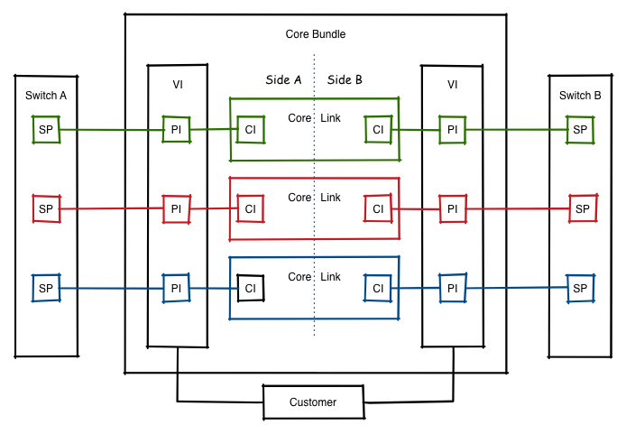
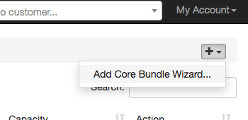
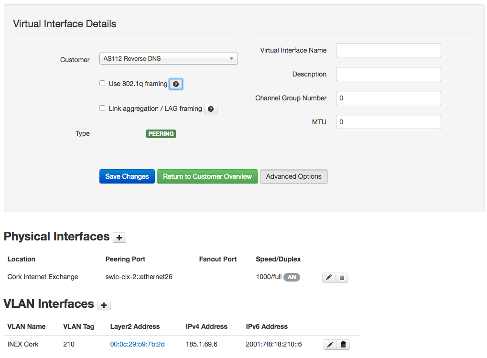

# Core Bundles

**DRAFT: THIS IS A WORK IN PROGRESS AND NOT READY FOR PRODUCTION USE - BARRYO Dec 2017**

This section explains how to manage *core bundles* - a *core bundle* is sometimes called an ISL (Inter-Switch Link). It is a link that connects two IXP switches together to carry production IXP traffic.

**Before reading this, it is expected that you have read and have a good understanding of the concepts from [Customer Connections](interfaces.md).** Virtual Interfaces (VIs), Physical Interfaces (PIs) and how they relate to Switch Ports (SPs) also apply here.

## Core Bundles Types and Database Overview

IXP Manager supports three types of core bundles:

1. **ECMP** (Equal-Cost Multi-Path): this is typically used when your peering LAN is built on an overlay such as VXLAN. A link between switch A and switch B is made up of one or more layer 3 links with (typically) a /31 network over each link and BGP peering sessions over each of these.
2. **L2-LAG**: a layer2 LAG (link aggregate group) is one or more ports between switch A and switch B using a LAG protocol which is typically LACP. This is the appropriate core bundle type even if the link between your switches is a single L2 link without LACP. You may often run a spanning-tree protocol here also.
3. **L3-LAG**: this is variation of the above two where you create a layer2 LAG with one or more ports between switch A and switch B. However, this LAG is configured as a L3 interface for running VXLAN or some other overlay network.

From IXP Manager's database perspective, these all are represented as follows:

From this, please note the following terminology, relationships and abbreviations which will be used throughout this document:

* a single Core Bundle (CB) entity (row in the database) represents the *parent* for all elements for the CB.
* when we talk about CBs, we talk about *Side A* and *Side B* - these are essentially the switches on each end/side of the CB.
* each CB is make up of one or more Core Links (CL). A CL is the database glue that ultimatelty connects/pairs the Switch Ports (SP) at each end.
* each CL has two Core Interfaces (CI). The CIs are syntactic sugar which allow us to connect into our standard Virtual Interface (VI) / Physical Interface (PI) / Switch Port (SP) schema. In a CL, the CI representing the a-side has a one-to-one relationship with a PI on the a-side and similarly for the CI representing the b-side.
* the PIs on each side are part of a VI. We thus inherit the same VI characteristics as customer interfaces such as whether LACP is enabled, MTU, LAG name and number, etc.
* VIs require a customer to *own* them. The customer (which is the same on both sides) is just the internal IXP Manager customer representing the IXP.
* each PI in turn has a one-to-one relationship with a switch port (SP).
* the SPs in turn all belong to the same *Switch A* on the a-side and *Switch B* on the b-side.

## Provisioning a Core Bundle via the Wizard

The only way to provision a new core bundle is to use the wizard. This can be accessed by:

1. selecting the *Core Bundles* link on the left hand side menu;
2. then, on the core bundles list page, select *Add Core Bundle Wizard...* from the *[+ v]* dropdown menu.

When you open the wizard, you will see something like the following (note this example represents the options for ECMP):

This can be used to provision a single port standard customer connection. If they customer needs a LAG or other non-standard options, these can be added afterwards.

### General Interface Settings

The customer should be prefilled and read-only as you enter the wizard from a specific customer overview page.

You would normally just select your main / primary peering VLAN from the `VLAN` dropdown. There are some notable exceptions:

* you may have more than one peering LAN. For example, INEX runs two resilient peering networks in Dublin and a separate regional exchange called INEX Cork. These are all unique VLANs.
* if you are provisioning a port dedicated to a private VLAN, you would just select that VLAN but leave *IPv4 Enabled* and *IPv6 Enabled* unchecked as IP addressing on private VLANs in not within an IX's purview.
* at INEX we also have quarantine VLANs for each peering VLAN. You would *typically* not select a quarantine VLAN here during provisioning unless you are using automation. Just put the interface in the primary peering LAN and let the *Physical Interface Settings* (see below) look after the quarantine flag.
* You should check the `Use 802.1q framing` checkbox if the port should be tagged facing the customer. If you are not using any automation tools, this will be informational for you rather than production affecting.
* Checking either or both of *IPv4 Enabled* and *IPv6 Enabled* will show the *IPv4 Details* and *IPv6 Details* (as per the above image) and enable these protocols for the customer's connection.

### Physical Interface Settings

This section allows you to select the physical interface / switch port for the connection.

* `Switch`: a dropdown list of all switches. Be careful as at present this list is all active switches rather than switches on the same infrastructure as the selected VLAN from *General Interface Settings*.
* `Port`: the switch port to use. This is dynamically populated when the switch is selected and **will only show ports of type *Peering* or type *Unset / Unknown* (these are set on a per port basis when adding / editing switches).**
* `Status`: the port status currently has one of five options. They effectively work as a boolean where *Connected* means on/enabled and the rest mean disabled as explained below. In practice, we tend to just use three states:

  1. `Connected`: this is the most important. When a *virtual interface* has **any** port with the **Connected** state, then IXP Manager will consider this connection active and will generate router configuration, monitoring configuration, etc.
  2. `Awaiting X-Connect`: the customer has requested an upgrade / new port and we are awaiting for the co-location provider / customer to get the cross connect organised.
  3. `Quarantine`: the port is connected and is under going quarantine prior to being moved onto the production peering LAN. During quarantine, INEX checks the port to ensure only ARP, IPv4 and IPv6 packets are received (no \*-discovery, STP, etc. as well as a number of other things).

The `Not Connected` and `Disabled` states have the same effect as (2) and (3) above and can be used as informational settings where (2) and (3) do not apply.

Speed and duplex are self explanatory. These settings in the *physical interface* entity are informational unless you are doing automation. They also have knock on effects to (for example) graphing - where the MRTG max value on an interface is set to this to prevent weird excessive spikes on counter rollovers.

### General VLAN Settings

These settings apply to the VLAN interface.

The *Max BGP Prefixes* is a setting used to determine max prefixes on router BGP peers - please [see the global version of this as explained in the customer section for details](customers.md#peering-details).

If `Apply IRRDB Filtering` is **not** set, then the route servers will accept any prefixes advertised by the customer (note that the default templates will filter martians and apply a max prefix limit). Generally speaking this is a **very bad idea** and should only be used in exceptional cases. *INEX never uses this setting - but demand from other IX's had it added.*

`Multicast Enabled` is informational only. INEX used to support multicast on the peering LAN but removed support in 2015 due to lack of interest and added complexity / cost when purchasing new switches.

If `Route Server Client` is checked, then IXP Manager will configure a BGP peer for this connection when generating [route server configurations](../features/route-servers.md). It is also used in other areas to show if a member uses the route servers or not, by the *Peering Manager* to calculate missing BGP sessions, etc.

Similarly, if `AS112 Client` is checked, then IXP Manager will configure a BGP peer for this connection when generating [AS112 router configurations](../features/as112.md).

### IPv4/IPv6 Details

When *IPv4 / IPv6 Enabled* is checked under *General Interface Settings* above, these two sections will be available.

The same details apply to IPv4 and IPv6 options so we will document them together.

* `IP Address`: the IP address to assign to this customer. This is taken from **available** IP addresses for the VLAN selected in *General Interface Settings*.
  * IP addresses are added in IXP Manager via the left hand menu under IXP Admin Actions.
  * The dropdown also works as an input field - this allows you to enter a new IP address that does not already exist in the field. When the wizard form is submitted, the address is added and associated with the VLAN. This is most useful for the IPv6 field if you are using a non-sequential numbering plan.
* `Hostname`: if you use IXP Manager to configure your [DNS ARPA](../features/dns-arpa.md) entries, the hostname entered here will be returned when a PTR request is made for the assigned IP address. Enter a complete hostname without trailing period such as: `www.example.com`.
* `BGP MD5 Secret`: The will be used for [generating router configurations](../features/routers.md).
  * The *circle refresh* icon in the IPv4 section will generate a cryptographically secure secret in modern browsers.
  * The *square refresh* icon in the IPv6 section will copy the value from the IPv4 section.
  * Note that setting a MD5 here does not mean that all router configurations have to include it. MD5 can be disabled entirely by a [routers configuration](../features/routers.md) or by templating.
* `Can Ping`: IXP Manager generates configuration for a number of other tools such as [Smokeping](/grapher/smokeping.md) and Nagios which ping customer routers. These are invaluable tools for problem solving, monitoring and graphing long term trends. We enable this by default unless a customer specifically asks us not to.
* `Can Monitor RC BGP`: this is more of a legacy option for configuration builders that used to check for established route collector BGP sessions and warn if not present. This is deprecated and will be removed.

## Viewing / Editing an Interface

Once an interface has been added as per the above wizard instructions, you can view and edit the interface by selecting the edit icon against the connection you are interested in from the *Ports* tab on the customer overview page. When you do that, you will see a screen such as the following:

You can see from the layout of this screen how it ties in with the schema explained above.

### Virtual Interface Details

The screenshot above shows the virtual interface details with the *Advanced Options* shown. The additional fields here that were not in the wizard are described below.

`Link aggregation / LAG framing` is mostly informational unless you are doing automation. There are some restrictions. Namely / specifically:

* if you have more than one physical interface, it will require you to set this.
* for a single interface, checking this indicates you want LACP on a single member LAG. This is useful and often common practice as it allows upgrades without outages.

The `Virtual Interface Name` is again mostly informational unless you are doing automation. It should be the start of the LAG name without the number. On an IOS device this would be `Port-channel` for example. Matched with this is the `Channel Group Number` with is tacked onto the end of the `Virtual Interface Name`. Leave it as 0 and when you check `Link aggregation / LAG framing` and save the changes, IXP Manager will set this to the next available unused port channel / bundle / LAG number on that switch.

Both `Description` and `MTU` are informational.

### Physical Interfaces

You can add additional physical interfaces to a connection / virtual interface. This effectivily means you are creating a LAG. The form for adding additional physical interfaces is indentical to that in the wizard.

### VLAN Interfaces

The most common use case of more than one VLAN Interface is when your customer may also have private VLANs on their connection.

Other than that, the VLAN interface add / edit form has all the same elements as the wizard with one addition:

* `Busy host`: this flag indicates that the customer's router is unusually slow to reply to ICMP echo requests and that when monitoring, the configuraiton should allow for warnings after a 5sec RTT rather than 1sec.
