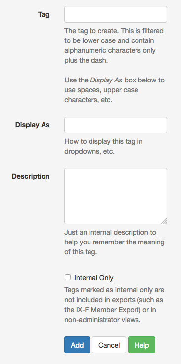

# Customer Tags

**IXP Manager** allows administrators to *tag* customers to indicate specific properties that are not built into IXP Manager by default. Some examples might include:

* commercial vs membership based relationship;
* special billing relationship (e.g. customer originally connected via 100Mb port which has been discontinued; customer now on 1Gb port but not paying until traffic exceeds 100Mb);

## Tag Management

Tags can be added / edited / deleted by clicking on the *Customers* option in the left hand side menu and then clicking on the *Tags* sub-option which appears. The form for adding tags is pretty straight-forward:



While the help text should be self-explanatory, here is some more detail and examples:

* **Tag**: should be something like: `commercial`, `member`, `100mb-upgrade-program`. Note that these are always lowercase alphanumeric characters and optional dashes.

* **Display AS**: allows you to provide something prettier when displaying the tag within IXP Manager. Examples following from the above might include: `Commercial`, `Member`, `100Mb Upgrade Program`.

* **Description**: allows you to add some text that may help you remember the specific use-case of a tag in five years time!

* **Internal Only**: if not set, then tags can be optionally including in various public / non-superadmin accessible APIs / pages / exports.


## Assigning Tags to Customers

When at least one tag has been created, the customer overview masthead will now provide the option to add tags to customers:


Once one or more tags have been added, they are shown in the masthead such as:


You will also find an option in the *Edit* menu of the customer overview page to *Manage Tags...*.


## Exporting Tags

Tags can be exported as part of the [IX-F Member Export](../features/ixf-export.md) process by adding `?withtags=1` to the API URL. For example:

```
https://ixp.example.com/api/v4/member-export/ixf/0.7?withtags=1
```

You have to specify `?withtags=1` as this is not part of the official IX-F Member Export specification.

When you request this, you will find an empty object with each customer that does not have tags in an `ixp_manager` namespace of the form:

```json
"ixp_manager": {
    "tags": []
}
```

And for those that do have tags, it will be of the form:

```json
"ixp_manager": {
    "tags": {
        "test-tag1": "Test Tag1",
        "test-tag2": "Test Tag2"
    }
}
```

where `test-tag2` is the tag and `Test Tag2` is the display name.
