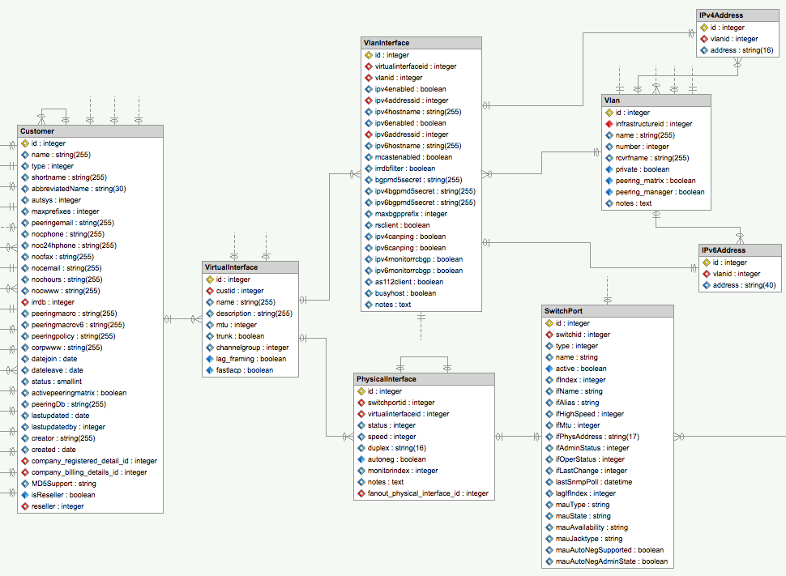
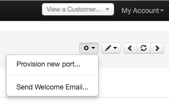
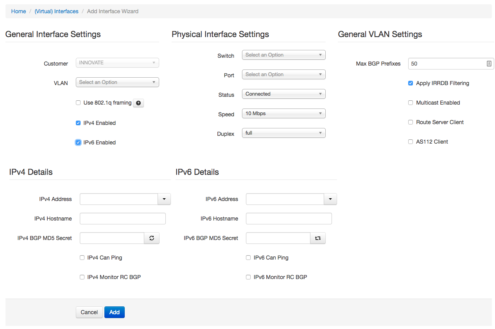

# Customer Interfaces

This section explains how to set up a customer interface.

## Database Overview

To fully understand how IXP Manager treats customer interfaces, you need a little background on the database schema. This will also help explain why we have laid out the UI as it is.

The original database schema dates from pre-2005 and has stood the test of time extremely well.

The above is described as follows:

* Customers have a 1:n relationship with virtual interfaces (VI). A VI is a container object that represents a customer connection and all the elements that make up that connection.
* VIs have a 1:n relationship with physical interfaces (PI).
  * A physical interface in turn has a 1:1 relationship with switch ports (SP).
  * PIs represent what we say the customer has (e.g. a 1Gb port). The SP has information from the switch itself and can help identify inconsistencies with what was expected to be configured/billed and what has actually been provisioned).
  * PIs can also move between SPs (e.g. customer upgrades / switch replacements / etc.).
  * By schematically representing PIs and SPs as different entities, we can associate elements such as usage graphs to the PI so these remain consistent when a SP changes.
  * Adding a second (or more) PI to a VI indicates that the port is a LAG.
* VIs have a 1:n relationship with VLAN interfaces (VLI). You can consider the PI element the layer2 / phsyical element and the VLI element the layer3 element.
  * A VLI has a 1:1 mapping with a VLAN (typicaly the peering LAN).
  * If IPv4 is enabled, the VLI has a 1:1 mapping to an IPv4 address from the given VLAN.
  * If IPv6 is enabled, the VLI has a 1:1 mapping to an IPv6 address from the given VLAN.
  * The VLI also indicates if this interface should have a route server peering session, MD5 passwords, etc. (all explaing below).

## Provisioning an Interface via the Wizard

The best way to provision a new interface for a customer is to use the wizard. This can be accessed from the customer's overview page via a menu on the top right:

When you open the wizard, you will see:

This can be used to provision a single port standard customer connection. If they customer needs a LAG or other non-standard options, these can be added afterwards.

### General Interface Settings

The customer should be prefilled and read-only as you enter the wizard from a specific customer overview page.

You would normally just select your main / primary peering VLAN from the `VLAN` dropdown. There are some notable exceptions:

* you may have more than one peering LAN. For example INEX runs two resilient peering networks in Dublin and a separate regional exchange called INEX Cork. These are all unique VLANs.
* if you are provisioning a port dedicated to a private VLAN, you would just select that VLAN but leave *IPv4 Enabled* and *IPv6 Enabled* unchecked as IP addressing on private VLANs in not within an IX's pervue.
* at INEX we also have quarantine VLANs for each peering VLAN. You would *typically* not select a quarantine VLAN here during provsioning unless you are using automation. Just put the interface in the primary peering LAN and let the *Physical Interface Settings* (see below) look after the quarantine flag.
* You should check the `Use 802.1q framing` checkbox if the port should be tagged facing the customer. If you are not using any automation tools, this will be informational for you rather than production affecting.
* Checking either or both of *IPv4 Enabled* and *IPv6 Enabled* will show the *IPv4 Details* and *IPv6 Details* (as per the above image) and enable these protocols for the customer's connection.

### Physical Interface Settings

This section allows you to select the physical interface / switch port for the connection.

* `Switch`: a dropdown list of all switches. Be careful as at present this list is all active switches rather than switches on the samer infrastructure as the selected VLAN from *General Interface Settings*.
* `Port`: the switch port to use. This is dynamically populated when the switch is selected and **will only show ports of type *Peering* or type *Unset / Unknown* (these are set on a per port basis when adding / editing switches).**
* `Status`: the port status currently has one of five options. They effectivily work as a boolean where *Connected* means on/enabled and the rest mean disabled as explained below. In practice, we tend to just use three states:

  1. `Connected`: this is the most important. When a *virtual interface* has **any** port with the **Connected** state, then IXP Manager will consider this connection active and will generate router configuration, monitoring configuration, etc.
  2. `Awaiting X-Connect`: the customer has requested an upgrade / new port and we are awaiting for the co-location provider / customer to get the cross connect organised.
  3. `Quarantine`: the port is connected and is under going quarantine prior to being moved onto the production peering LAN. During quarantine, INEX checks the port to ensure only ARP, IPv4 and IPv6 packets are received (no \*-discovery, STP, etc. as well as a number of other things).

The `Not Connected` and `Disabled` states have the same effect as (2) and (3) above and can be used as informational settings where (2) and (3) do not apply.

Speed and duplex are self explanatory. These set set in the *physical interface* entitity are informational unless you are doing automation. They also have knock on effects to (for example) graphing - where the MRTG max value on an interface is set to this to prevent weird excessive spikes on counter rollovers.

### General VLAN Settings

These settings apply to the the VLAN interface.

The *Max BGP Prefixes* is a setting used to determine max prefixes on router BGP peers - please [see the global version of this as explained in the customer section for details](customers.md#peering-details).

If `Apply IRRDB Filtering` is **not** set, then the route servers will accept any prefixes advertised by the customer (note that the default templaes will filter martians and apply a max prefix limit). Generally speaking this is a **very bad idea** and should only be used in exceptional cases. *INEX never uses this setting - but demand from other IX's had it added.*

`Multicast Enabled` is informational only. INEX used to support multicast on the peering LAN but removed support in 2015 due to lack of interest and added complexity / cost when purchasing new switches.

If `Route Server Client` is checked, then IXP Manager will configure a BGP peer for this connection when generating [route server configurations](../features/route-servers.md). It is also used in other areas to show if a member uses the route servers or not, by the *Peering Manager* to calculate missing BGP sessions, etc.

Similarly, if `AS112 Client` is checked, then IXP Manager will configure a BGP peer for this connection when generating [AS112 router configurations](../features/as112.md).

### IPv4/IPv6 Details

When *IPv4 / IPv6 Enabled* is checked under *General Interface Settings* above, these two sections will be available.

The same details apply to IPv4 and IPv6 options so we will document them together.

* `IP Address`: the IP address to assign to this customer. This is taken from **available** IP addresses for the VLAN selected in *General Interface Settings*.
  * IP addresses are added in IXP Manager via the left hand menu under IXP Admin Actions.
  * The dropdown also works as an input field - this allows you to enter a new IP address that does not already exist in the field. When the wizard form is submitted, the address is added and associated with the VLAN. This is most useful for the IPv6 field if you are using a non-sequenctial numbering plan.
* `Hostname`: if you use IXP Manager to configure your [DNS ARPA](../features/dns-arpa.md) entries, the hostname entered here will be returned when a PTR request is made for the assigned IP address. Enter a complete hostname without trailing period such as: `www.example.com`.
* `BGP MD5 Secret`: The will be used for [generating router configurations](../features/routers.md).
  * The *circle refresh* icon in the IPv4 section will generate a cryptographically secture secret in modern browsers.
  * The *square refresh* icon in the IPv6 section will copy the value from the IPv4 section.
  * Note that setting a MD5 here does not mean that all router configurations have to include it. MD5 can be disabled entirely by a [routers configuration](../features/routers.md) or by templating.
* `Can Ping`: IXP Manager generates configuration for a number of other tools such as [Smokeping](../features/smokeping.md) and Nagios which ping customer routers. These are invaluable tools for problem solving, monitoring and graphing long term trends. We enable this by default unless a customer specifically asks us not to.
* `Can Monitor RC BGP`: this is more of a legacy option for configuration builders that used to check for established route collector BGP sessions and warn if not present. This is depreacted and will be removed.
